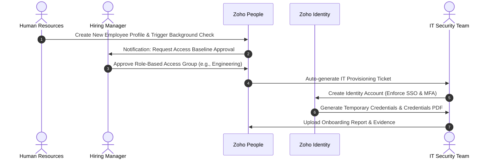
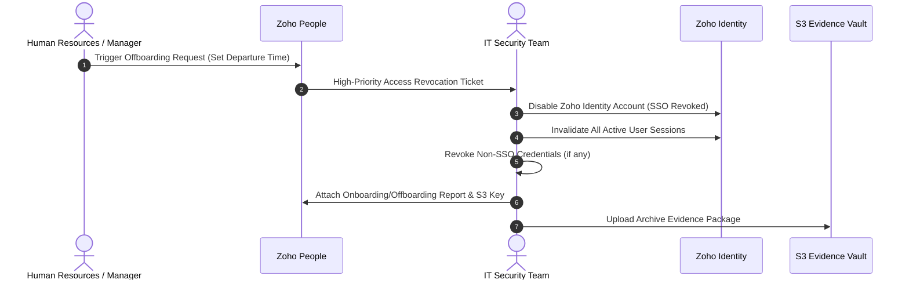

# Zoho Identity & Zoho People — Identity & Access Lifecycle Controls

This policy documents the standard operating procedures (SOPs) for the non-technical access controls of the organization. It addresses the onboarding, role modification, and offboarding requirements under the **SOC 2 Trust Services Criteria for Security and Access Control (CC6.1, CC6.2, CC6.3, and CC8.1)**.

---

## 1. Governance & Control Objective
To ensure that access to the organization's information systems and client data environments is:
1. Authorized by appropriate management.
2. Granted based on the **Principle of Least Privilege (PoLP)** and **Role-Based Access Control (RBAC)**.
3. Timely revoked or modified when an employee's status or role changes.

---

## 2. Onboarding Access Provisioning Process (SOC 2 CC6.1, CC6.2)

### 2.1. Request, Review, and Approval Workflow
*   **Initiation:** When a candidate signs an offer letter, HR creates a new employee profile in **Zoho People**. This profile includes their official start date, department, and role.
*   **Background Screening:** A background check is automatically initiated via Zoho People's integration with the screening vendor (e.g., Checkr). The system flags the profile if the screening is not completed and passed before the start date (**SOC 2 CC1.2**).
*   **Access Request:** The hiring manager receives an automated prompt to select the employee's role-based access baseline group (e.g., `Engineering-Developer`, `HR-Specialist`).
*   **Approval Gate:** Any access exceeding the default baseline (such as AWS Administrator or Production Database access) requires secondary authorization from the Security Team or Tech Lead, logged in the IT ticket.
*   **Provisioning SLA:** IT operations must provision the user account in **Zoho Identity** within **24 hours** of the start date.

### 2.2. Authentication & Credential Management
*   **Single Sign-On (SSO):** Zoho Identity serves as the centralized Identity Provider (IdP). All downstream applications (AWS, GitHub, Slack, etc.) are integrated via SAML 2.0 / OIDC. Direct passwords for individual SaaS apps are disabled.
*   **Multi-Factor Authentication (MFA):** MFA is **mandatorily enforced** on Zoho Identity. Employees cannot access any company portal or tool without enrolling an MFA device (authenticator app or hardware key) upon their first login.
*   **Password Complexity Policies:**
    *   Minimum length of **14 characters**.
    *   Requirement of uppercase, lowercase, numbers, and special characters.
    *   Account lockout after **5 failed attempts**.
    *   Password expiration and mandatory rotation every **90 days**.

### 2.3. Control Mapping: Onboarding Checklist
| Step | Action Item | Target System | SOC 2 Mapping | SLA / Standard | Evidence Captured |
|---|---|---|---|---|---|
| **ON-01** | Signed Offer Letter & Profile Creation | Zoho People | CC8.1 / P6.1 | Prior to Start Date | Offer PDF, Audit Trail |
| **ON-02** | Background Screening Check | Zoho People / Checkr | CC1.2 | Completed before Day 1 | Checkr Report Status |
| **ON-03** | NDA & Employee Policy Sign-off | Zoho People / Sign | P6.1 | Completed on Day 1 | Signed PDF, Zoho Sign Log |
| **ON-04** | Role-Based Access Approval | Zoho People | CC6.1 / CC6.2 | Prior to Provisioning | Approval Log, ticket ID |
| **ON-05** | SSO Account Provisioning | Zoho Identity | CC6.2 / CC6.3 | Within 24 hours | Creation log timestamp |
| **ON-06** | Mandatory MFA Enrollment | Zoho Identity | CC6.3 | First login gate | MFA Status = Enrolled |
| **ON-07** | Security Awareness Training | Zoho People / LMS | CC2.2 | Within 30 days of hire | Completion Certificate |

---

## 3. Offboarding & Access Revocation Process (SOC 2 CC6.1, CC6.3)

### 3.1. Termination Notification
*   **Voluntary Departure:** HR initiates an Offboarding workflow in Zoho People immediately upon receipt of a resignation letter. The deprovisioning ticket is scheduled for the departure date.
*   **Involuntary Termination:** HR coordinates directly with the Security Team. Access is revoked **immediately** (prior to or during the termination meeting) without advanced warning to the employee.

### 3.2. Deprovisioning SLAs and Timelines
*   **Emergency / Involuntary SLA:** Total access revocation must be completed within **2 hours** of termination.
*   **Standard Departure SLA:** All accounts must be suspended by **5:00 PM local time** on the employee's final day.

### 3.3. Revocation Sequence
1.  **Central SSO Disable:** IT disables the employee's user status in **Zoho Identity**. This instantly blocks access to AWS, GitHub, Zoho Mail, and all federated applications.
2.  **Session Invalidation:** IT forces a session reset, terminating all active browser, OAuth, and API tokens associated with the employee.
3.  **Non-Federated Credentials:** IT checks the password vault for any team-shared accounts the user had access to and immediately rotates their credentials.
4.  **Hardware Collection:** HR retrieves all corporate-issued laptops, security keys, and physical access badges.

### 3.4. Control Mapping: Offboarding Checklist
| Step | Action Item | Target System | SOC 2 Mapping | SLA / Standard | Evidence Captured |
|---|---|---|---|---|---|
| **OFF-01** | Termination Ticket & Departure Date | Zoho People | CC6.1 | Immediate / Scheduled | Ticket timestamp |
| **OFF-02** | Disable SSO User Status | Zoho Identity | CC6.3 | <2 hrs (Emerg), <24 hrs | Identity Audit Log (Disabled) |
| **OFF-03** | Terminate Active Sessions | Zoho Identity | CC6.3 | Instant upon Disable | Action log entry |
| **OFF-04** | Deprovision Downstream Keys | AWS IAM / GitHub | CC6.3 | Within 24 hours | AWS CLI / GitHub API audit |
| **OFF-05** | Archive User Data & Evidence | AWS S3 Vault | C1.1 / A1.1 | Within 30 days | `offboarding-report.pdf` |

---

## 4. Regular User Access Reviews (UAR) (SOC 2 CC6.3)
To ensure access permissions do not drift over time:
*   **Frequency:** Access rights are reviewed **quarterly** by IT Security and Department Leads.
*   **Scope:** The review includes all active accounts in Zoho Identity, active IAM users in AWS, and members/teams in the GitHub organization.
*   **Recertification:** Managers must certify that their direct reports' group memberships are still required for their current jobs.
*   **Revocation SLA:** Unapproved or stale permissions must be stripped within **5 business days** of the review completion.
*   **Reporting:** A summary report of the UAR, including all modifications made, is saved in the S3 Compliance Vault as audit evidence.
